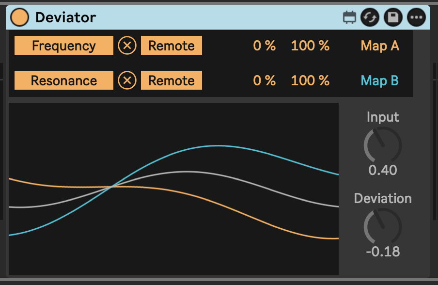

# Modulation Deviation

This device exists to make it easy to have two modulation targets deviate opposite of one another.

You might want to use it to stack up instruments or filters in a rack and run them in parallel, controlling different aspects of timbre of each device/instrument in opposite ways.

## Installation

[Download the newest release](https://github.com/zsteinkamp/m4l-SimulScrub/releases) or clone this repository, and drag the `SimulScrub.amxd` device into a track in Ableton Live.

## Changelog

- 2025-07-22 [v1](https://github.com/zsteinkamp/m4l-SimulScrub/releases/download/v1/SimulScrub-v1.amxd) - Initial Release.

## Usage

Add this device to a track and map the A and B signals to parameters in your Live Set.

Adjust or modulate the `Input` and `Deviation` dials to get the effect you want.

## TODO

- ...
